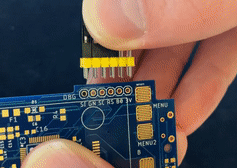

# Debug connector

It's often needed to connect a SWD debugger to a board.

We found [Black Magic Probe](https://github.com/blacksphere/blackmagic/wiki) to work well,
for a variety of MCUs, and it doesn't require openocd.
You can use their beautifully made hardware, or flash an existing
board with Black Magic firmware.
People also often use ST Link v2 clones, especially for STM chips.

One way or another, you need to connect the SWDIO and SWCLK lines from the
debugger to the MCU.
Often these are connected to test pins, to which you have to solder.
Sometimes there is a standard 0.05" 10 pin ARM debug connector,
however these require a part to be soldered on the board.
Otherwise, people use a footprint on the PCB to which they connect a 
special proprietary (and expensive) connector cable.

Here we propose simple and cost effective solutions, which do not require soldering,
and has zero PCB cost.

## One row connector

Use a standard 0.1" spacing header holes with 40mil drill and place them so that
the middle of the holes are exactly 0.1" from the edge of the board.
Then use a two-row male header, and plug it into the holes on the short side
and connect female jumper cables on the long side.
The header will bend a little, forcing good electrical connection.
You usually want to plug it starting from the edge.





## Two row connector

Like the above, but use castellated holes for the second row of pins.

## Pinout

The recommended pinout of one row header:

```
GND SWCLK 3V SWDIO
```

Do not put 3V and GND on opposite ends, since plugging the connector the wrong way
would cause -3V to run through MCU.

You can add another GND connection to the right to make the plug symmetric as far
as power is concerned.
If you want to add a RESET pin, or a logging pin (possibly SWO, but can be custom as well),
also add it to the right.

Note that with the two row cable plugged into a one row of holes, it only
matter if you plug it in from the top or bottom of the board, which is quite
easy to notice.
Rotating the connector will result in no electrical connection.

## Credits

Various pieces of the idea came from Steve Hodges, Jonny Austin, Michal Moskal, and James Devine.
