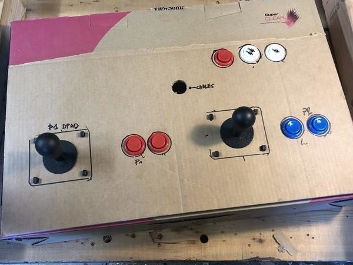
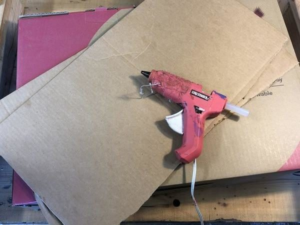
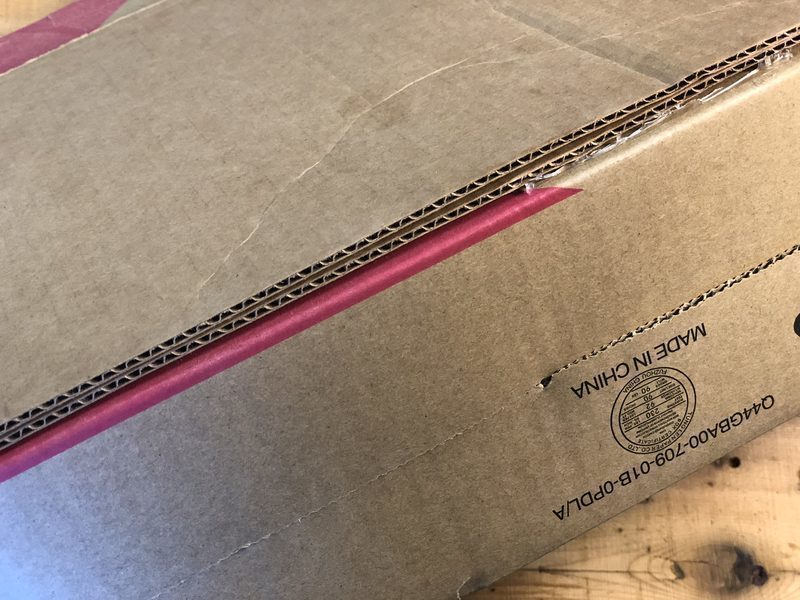
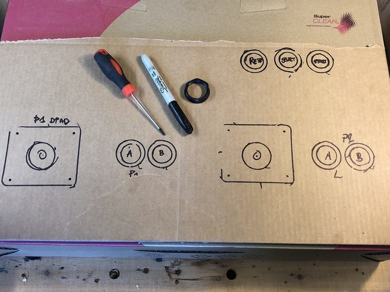
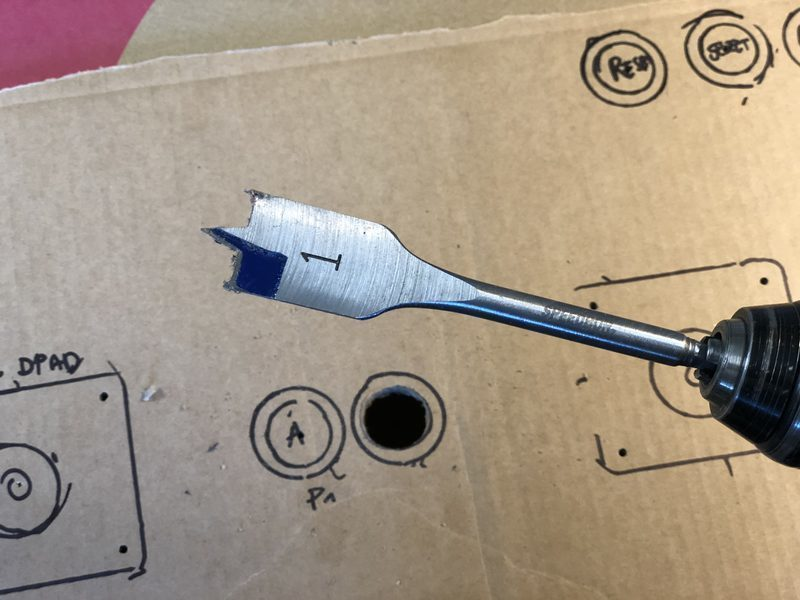
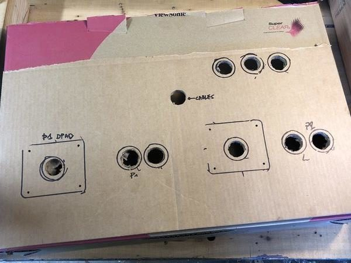
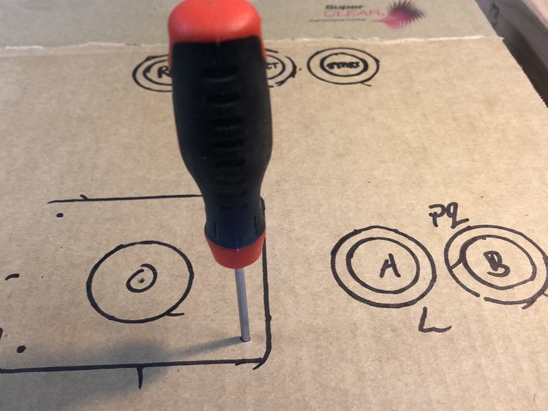
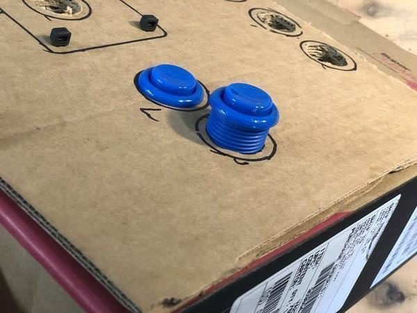

# Prepping the cardboard box

Find a cardboard box large enough to hold your buttons and joystick. If you purchased a computer monitor for the arcade, just use the box that the screen came in.

## Reinforcement

By add adding 1 or 2 layers of cardboard to the surface that will hold the buttons and joystick, you can make the playing surface more rigid. We recommend doing this so that your console will hold up when the action gets intense!

### Extra pieces

Cut out the additional cardboard sheets.

### Glue the layers together

Use a glue gun to attach and layer them to the control panel surface.

## Button layout

Use a marker to **trace** out where your buttons and joysticks will mount on the box.

https://youtu.be/hdFZYOBV4_c
 
For the buttons, use the black plastic ring to trace a pattern for their hole size; for the joystick, remove the stick from its base if you need that to help you trace those.

### ~ hint

#### Where should my buttons go?

It's on purpose that we did not provide any diagram of a panel with precise measurements. This is to encourage you to create your own layout. Customize!

Things to think about when drawing your layout:

* are my buttons too far apart?
* should buttons be aligned in rows/columns or be slightly diagonal?

### ~

## Holes

For best results, we recommend using a drill bit and a cordless drill. You could also use manual cardboard
cutting tools but it is hard to achieve a nice clean hole cut.

### Buttons and joysticks

Use a 1" bit to drill the holes for the buttons and joystick centers. 

https://youtu.be/NqXG0nbPK8k

### Wire passage

Drill 1 additional hole in the center to pass the wires through.

### Joystick zip ties

Use a screwdriver or the blade of the scissor to cut **small** holes on the corners of the joystick.
The holes should be large enough to let a **zip tie** go through (or a machine screw).

### ~ hint

#### Paint and style!

If you plan to paint or put some style elements (marker drawings, stickers, etc.) on your control panel, **now** is a great time to do it... Before it gets populated with the electronics.

### ~

### Test fit

Try squeezing a few buttons and zip ties in the holes. If they don't fit it, try rotating them in just like a screw.

### Access door

Cut an access door at the back to allow easier wiring later on.

## Next step...

## ~button ./wires

Prepping the wires

## ~
