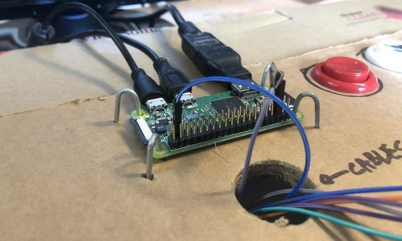
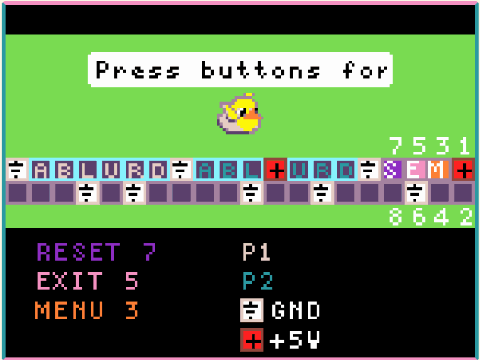
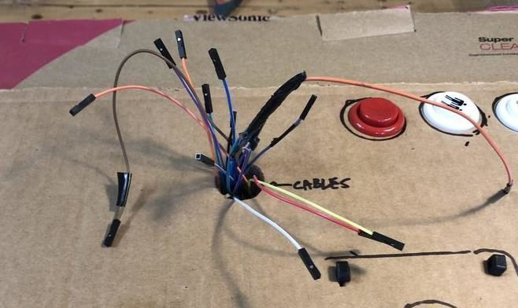

# Raspberry Pi Zero Setup

## Firwmare setup

### Install the firmware

Follow the [Firmware Installation Instructions](https://learn.adafruit.com/makecode-arcade-with-raspberry-pi-zero/firmware#firmware-3-1)
to re-image your Raspberry Pi SD card with the MakeCode Arcade firmware.
Make sure to pick the `arcade-cardboard.zip` file.

### 4:3 VGA screens

If you are using a VGA screen via a HDMI->VGA adapter. Apply the following changes to ``config.txt``

    framebuffer_width=640
    framebuffer_height=480
    hdmi_mode=1

## Test the firmware

Now, let's try out the firmware.

- [ ] insert the SD card in the Raspberry Pi Zero
- [ ] connect the screen cable
- [ ] connect USB power cable. Double check which one you plug in!
- [ ] connect the USB data cable

You should see the Configuration Program:

You can use this program on the Raspberry Pi panel to help make sure your wiring is correct.

## Wiring

Route all of the female header connecters on the jumper wires from the inside of the box through the hole for the wires.

### Connect GROUND pins

Use the Test Program to identity which header is Ground on the Raspberry Pi Zero. 
You should have **3 jumper wires** with **female header** connectors wrapped with electrical tape. These connect to the **GROUND**
pins.

### Connect the all of the buttons except EXIT, MENU, RESET

Use the Test Program to determine which header the buttons will go to. You can connect them randomly then use the program to reorder them:

- [ ] connect a wire to a valid pin location
- [ ] press the buttons until you identity which button this wire connects to
- [ ] move the jumper wire to the correct jumper using the pinout map
- [ ] press the button again to test the correct mapping

 
https://youtu.be/-P5I_BzoYdg

### Connect EXIT, MENU

Use the program to determine which header those buttons will go to.

- [ ] pressing **EXIT** exits the current game and goes back to the selection screen
- [ ] pressing **MENU** will pop up the game menu

Once you're done connecting all the wires, press the **A** an **B** buttons in this order, **A B A B A B**, to terminate the configuration program.
You should now see the game selection menu.
Next time you reboot your Pi, it will go straight to the menu and will not run the configuration program.

### Update or customize the menu

If you want to customize the menu displayed on the Pi:

* clone https://github.com/microsoft/pxt-arcade-cabinet-menu
* follow instructions to build project
* click ``|Download|`` and select the **Pi 0** hardware profile
* test your menu changes in the simulator
* make sure that your project is named **.menu**
* **Compile** and drop the menu into your ARCADE drive after connecting your Pi to the computer
